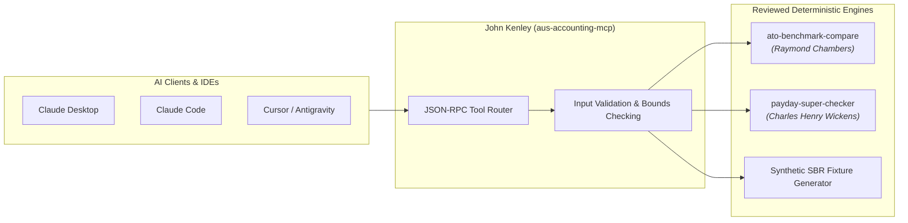

<!-- mcp-name: io.github.ryanduguid/aus-accounting-mcp -->
# John Kenley (`aus-accounting-mcp`)

[](https://www.python.org/)
[](https://modelcontextprotocol.io/)
[](tests)
[](https://glama.ai/mcp/servers/ryanduguid/aus-accounting-mcp)
[](https://smithery.ai/server/@ryanduguid/aus-accounting-mcp)
[](LICENSE)

An open-source **Model Context Protocol (MCP) server** exposing reviewed Australian computational accounting engines directly to AI agents. Designed for seamless plug-and-play integration with **Claude Desktop**, **Claude Code**, **Cursor**, **Zed**, and **Antigravity**.

---

## ⚡ Quick Start

### 1. Install & Run via `uvx` (Zero-Config)
```bash
# Test the MCP server locally
uvx --from git+https://github.com/ryanduguid/JohnKenley.git aus-accounting-mcp
```

### 2. Add to Claude Code
```bash
claude mcp add aus-accounting -- uvx --from git+https://github.com/ryanduguid/JohnKenley.git aus-accounting-mcp
```

### 3. Add to Smithery CLI
```bash
npx -y @smithery/cli install @ryanduguid/aus-accounting-mcp --client claude
```

---

## 🏛️ Architecture & Grounding



This server does **not** hallucinate or approximate tax law. All computations are strictly delegated to deterministic, unit-tested engine packages:
- **[CharlesHenryWickens](https://github.com/ryanduguid/CharlesHenryWickens)** (`payday-super-checker`, `paydaysuper`) – Evaluates statutory Payday Super due dates under *SGAA 1992 s 6(1)*.
- **[RaymondChambers](https://github.com/ryanduguid/RaymondChambers)** (`ato-benchmark-compare`) – Compares trial balance expense buckets against official ATO small-business benchmarks.
- **Division 7A** is explicitly **refused** until a formally reviewed engine is wired.
- **SBR Payloads** are strictly **synthetic fixtures** (`mode: synthetic`) for agent testing, never unverified live lodgments.

---

## 🛠️ Tools Exposed

| Tool | Engine | What it does |
| :--- | :--- | :--- |
| `list_ato_benchmark_industries` | `ato-benchmark-compare` | List or search the official ATO small-business benchmark categories |
| `get_ato_benchmarks` | `ato-benchmark-compare` | Compare supplied turnover & expense buckets to statutory ATO benchmark ranges |
| `calc_payday_super_deadline` | `payday-super-checker` | Evaluate single contribution statutory due date & remittance compliance |
| `calc_div7a_repayment` | *None* | Returns explicit refusal with statutory explanation until engine is certified |
| `generate_synthetic_sbr_fixture` | Local fixture | Generates synthetic CTR/BAS payloads for AI agent eval harnesses (`synthetic: true`) |

> **Integrity Invariants**: Monetary values are handled as quantized exact decimals (never IEEE 754 binary floats). Input bounds are capped at AUD 1,000,000,000,000.00. Missing expense buckets are categorized as `not_supplied` rather than assumed zero.

---

## 💻 Client Configuration

<details>
<summary><b>Claude Desktop</b> (<code>%APPDATA%\Claude\claude_desktop_config.json</code>)</summary>

```json
{
  "mcpServers": {
    "aus-accounting": {
      "command": "uvx",
      "args": ["--from", "git+https://github.com/ryanduguid/JohnKenley.git", "aus-accounting-mcp"]
    }
  }
}
```
</details>

<details>
<summary><b>Cursor</b> (<code>.cursor/mcp.json</code>)</summary>

```json
{
  "mcpServers": {
    "aus-accounting": {
      "command": "uvx",
      "args": ["--from", "git+https://github.com/ryanduguid/JohnKenley.git", "aus-accounting-mcp"]
    }
  }
}
```
</details>

<details>
<summary><b>Zed Editor</b> (<code>~/.config/zed/settings.json</code>)</summary>

```json
{
  "context_servers": {
    "aus-accounting": {
      "command": {
        "env": {},
        "path": "uvx",
        "args": ["--from", "git+https://github.com/ryanduguid/JohnKenley.git", "aus-accounting-mcp"]
      }
    }
  }
}
```
</details>

---

## 📜 Historical Context

John Kenley was the first technical officer of the Australian Society of Accountants (now CPA Australia) and moved to a full-time role at the Australian Accounting Research Foundation in 1966, where he helped establish the Auditing Standards Board. This MCP server honors that heritage by exposing certified, deterministic accounting engines only.

## 📄 License & Citation

Licensed under the [MIT License](./LICENSE).

To cite this repository in technical literature or software documentation:
```bibtex
@software{duguid_aus_accounting_mcp_2026,
  author = {Duguid, Ryan},
  title = {aus-accounting-mcp: Model Context Protocol Server for Australian Taxation and Computational Accounting},
  year = {2026},
  url = {https://github.com/ryanduguid/JohnKenley}
}
```
